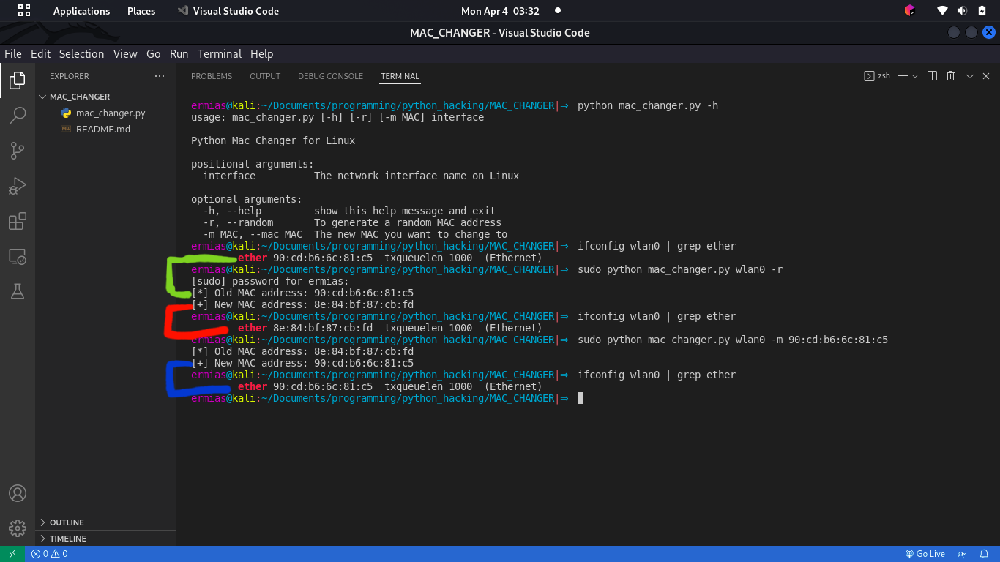

# MAC Address changer for linux

*A media access control address (MAC address) is a unique identifier assigned to each network interface in any device that connects to a network. [Read more...](https://en.wikipedia.org/wiki/MAC_address)*

## Advantage:

*Changing MAC address has many benefits, including MAC address blocking prevention; if your MAC address is blocked on an access point, you simply change it to continue using that network.*

---

## Usage:

**1. change to a random MAC address**

`>_ sudo python mac_changer.py <interface name> -r`

*-r to randomize a MAC address*

**Example: `sudo python mac_changer.py wlan0 -r`**

**Output:**

```
[*] Old MAC address: 90:cd:b6:6c:81:c5
[+] New MAC address: 8e:84:bf:87:cb:fd
```

**2. change to a specified MAC address**

`>_ sudo python mac_changer.py <interface name> -m <mac address>`

**Example: `sudo python mac_changer.py wlan0 -m 90:cd:b6:6c:81:c5`**

*-m set the new MAC address we want to change to*

**Output:**

```
[*] Old MAC address: 8e:84:bf:87:cb:fd
[+] New MAC address: 90:cd:b6:6c:81:c5
```

**Screenshot:**



---
*WARNING! it only works for linux os*

*Created by **Ermias Bahru** as a simple hacking tool for learning purpose only*
